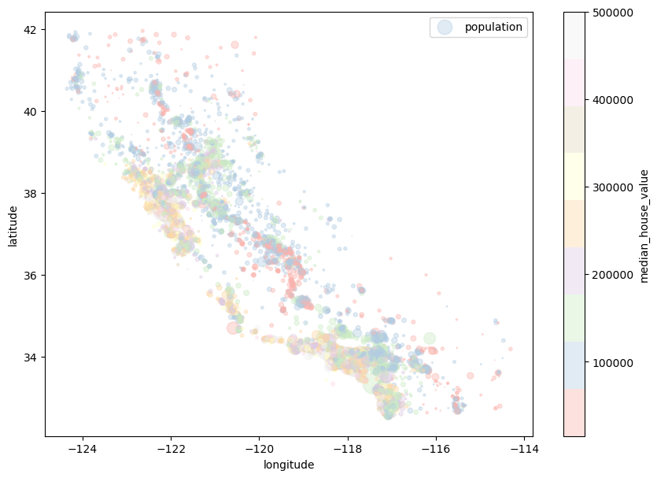

# Machine Learning with California Housing DataSet

## Create a function to download the dataset


```python
import os
import tarfile
import urllib
```


```python
DOWNLOAD_ROOT = "https://raw.githubusercontent.com/ageron/handson-ml2/master/"
HOUSING_PATH = os.path.join("datasets", "housing")
HOUSING_URL = DOWNLOAD_ROOT + "datasets/housing/housing.tgz"
PROJECT_ROOT_DIR = "/"
```


```python
def fetch_housing_data(housing_url=HOUSING_URL, housing_path=HOUSING_PATH):
    if not os.path.isdir(housing_path):
        os.makedirs(housing_path)
    tgz_path = os.path.join(housing_path, "housing.tgz")
    urllib.request.urlretrieve(housing_url, tgz_path)
    housing_tgz = tarfile.open(tgz_path)
    housing_tgz.extractall(path=housing_path)
    housing_tgz.close()
```


```python
fetch_housing_data()
```

### Import the downloaded data into the project

### explore the dataset


```python
import pandas as pd
```


```python
def load_housing_data(housing_path=HOUSING_PATH):
    csv_path = os.path.join(housing_path, "housing.csv")
    return pd.read_csv(csv_path)
```

Display the first 5 rows


```python
housing = load_housing_data()
```


```python
housing.head()
```


<div>
<style scoped>
    .dataframe tbody tr th:only-of-type {
        vertical-align: middle;
    }

    .dataframe tbody tr th {
        vertical-align: top;
    }

    .dataframe thead th {
        text-align: right;
    }
</style>
<table border="1" class="dataframe">
  <thead>
    <tr style="text-align: right;">
      <th></th>
      <th>longitude</th>
      <th>latitude</th>
      <th>housing_median_age</th>
      <th>total_rooms</th>
      <th>total_bedrooms</th>
      <th>population</th>
      <th>households</th>
      <th>median_income</th>
      <th>median_house_value</th>
      <th>ocean_proximity</th>
    </tr>
  </thead>
  <tbody>
    <tr>
      <th>0</th>
      <td>-122.23</td>
      <td>37.88</td>
      <td>41.0</td>
      <td>880.0</td>
      <td>129.0</td>
      <td>322.0</td>
      <td>126.0</td>
      <td>8.3252</td>
      <td>452600.0</td>
      <td>NEAR BAY</td>
    </tr>
    <tr>
      <th>1</th>
      <td>-122.22</td>
      <td>37.86</td>
      <td>21.0</td>
      <td>7099.0</td>
      <td>1106.0</td>
      <td>2401.0</td>
      <td>1138.0</td>
      <td>8.3014</td>
      <td>358500.0</td>
      <td>NEAR BAY</td>
    </tr>
    <tr>
      <th>2</th>
      <td>-122.24</td>
      <td>37.85</td>
      <td>52.0</td>
      <td>1467.0</td>
      <td>190.0</td>
      <td>496.0</td>
      <td>177.0</td>
      <td>7.2574</td>
      <td>352100.0</td>
      <td>NEAR BAY</td>
    </tr>
    <tr>
      <th>3</th>
      <td>-122.25</td>
      <td>37.85</td>
      <td>52.0</td>
      <td>1274.0</td>
      <td>235.0</td>
      <td>558.0</td>
      <td>219.0</td>
      <td>5.6431</td>
      <td>341300.0</td>
      <td>NEAR BAY</td>
    </tr>
    <tr>
      <th>4</th>
      <td>-122.25</td>
      <td>37.85</td>
      <td>52.0</td>
      <td>1627.0</td>
      <td>280.0</td>
      <td>565.0</td>
      <td>259.0</td>
      <td>3.8462</td>
      <td>342200.0</td>
      <td>NEAR BAY</td>
    </tr>
  </tbody>
</table>
</div>


Look at the row and column count


```python
housing.info()
```

    <class 'pandas.core.frame.DataFrame'>
    RangeIndex: 20640 entries, 0 to 20639
    Data columns (total 10 columns):
     #   Column              Non-Null Count  Dtype  
    ---  ------              --------------  -----  
     0   longitude           20640 non-null  float64
     1   latitude            20640 non-null  float64
     2   housing_median_age  20640 non-null  float64
     3   total_rooms         20640 non-null  float64
     4   total_bedrooms      20433 non-null  float64
     5   population          20640 non-null  float64
     6   households          20640 non-null  float64
     7   median_income       20640 non-null  float64
     8   median_house_value  20640 non-null  float64
     9   ocean_proximity     20640 non-null  object 
    dtypes: float64(9), object(1)
    memory usage: 1.6+ MB


look at the non-numerical data


```python
housing["ocean_proximity"].value_counts()
```


    <1H OCEAN     9136
    INLAND        6551
    NEAR OCEAN    2658
    NEAR BAY      2290
    ISLAND           5
    Name: ocean_proximity, dtype: int64


describe the dataset


```python
housing.describe()
```


<div>
<style scoped>
    .dataframe tbody tr th:only-of-type {
        vertical-align: middle;
    }

    .dataframe tbody tr th {
        vertical-align: top;
    }

    .dataframe thead th {
        text-align: right;
    }
</style>
<table border="1" class="dataframe">
  <thead>
    <tr style="text-align: right;">
      <th></th>
      <th>longitude</th>
      <th>latitude</th>
      <th>housing_median_age</th>
      <th>total_rooms</th>
      <th>total_bedrooms</th>
      <th>population</th>
      <th>households</th>
      <th>median_income</th>
      <th>median_house_value</th>
    </tr>
  </thead>
  <tbody>
    <tr>
      <th>count</th>
      <td>20640.000000</td>
      <td>20640.000000</td>
      <td>20640.000000</td>
      <td>20640.000000</td>
      <td>20433.000000</td>
      <td>20640.000000</td>
      <td>20640.000000</td>
      <td>20640.000000</td>
      <td>20640.000000</td>
    </tr>
    <tr>
      <th>mean</th>
      <td>-119.569704</td>
      <td>35.631861</td>
      <td>28.639486</td>
      <td>2635.763081</td>
      <td>537.870553</td>
      <td>1425.476744</td>
      <td>499.539680</td>
      <td>3.870671</td>
      <td>206855.816909</td>
    </tr>
    <tr>
      <th>std</th>
      <td>2.003532</td>
      <td>2.135952</td>
      <td>12.585558</td>
      <td>2181.615252</td>
      <td>421.385070</td>
      <td>1132.462122</td>
      <td>382.329753</td>
      <td>1.899822</td>
      <td>115395.615874</td>
    </tr>
    <tr>
      <th>min</th>
      <td>-124.350000</td>
      <td>32.540000</td>
      <td>1.000000</td>
      <td>2.000000</td>
      <td>1.000000</td>
      <td>3.000000</td>
      <td>1.000000</td>
      <td>0.499900</td>
      <td>14999.000000</td>
    </tr>
    <tr>
      <th>25%</th>
      <td>-121.800000</td>
      <td>33.930000</td>
      <td>18.000000</td>
      <td>1447.750000</td>
      <td>296.000000</td>
      <td>787.000000</td>
      <td>280.000000</td>
      <td>2.563400</td>
      <td>119600.000000</td>
    </tr>
    <tr>
      <th>50%</th>
      <td>-118.490000</td>
      <td>34.260000</td>
      <td>29.000000</td>
      <td>2127.000000</td>
      <td>435.000000</td>
      <td>1166.000000</td>
      <td>409.000000</td>
      <td>3.534800</td>
      <td>179700.000000</td>
    </tr>
    <tr>
      <th>75%</th>
      <td>-118.010000</td>
      <td>37.710000</td>
      <td>37.000000</td>
      <td>3148.000000</td>
      <td>647.000000</td>
      <td>1725.000000</td>
      <td>605.000000</td>
      <td>4.743250</td>
      <td>264725.000000</td>
    </tr>
    <tr>
      <th>max</th>
      <td>-114.310000</td>
      <td>41.950000</td>
      <td>52.000000</td>
      <td>39320.000000</td>
      <td>6445.000000</td>
      <td>35682.000000</td>
      <td>6082.000000</td>
      <td>15.000100</td>
      <td>500001.000000</td>
    </tr>
  </tbody>
</table>
</div>


graph the dataset


```python
%matplotlib inline
```


```python
import matplotlib.pyplot as plt
```


```python
housing.hist(bins=50, figsize=(20,15))
```


    array([[<AxesSubplot:title={'center':'longitude'}>,
            <AxesSubplot:title={'center':'latitude'}>,
            <AxesSubplot:title={'center':'housing_median_age'}>],
           [<AxesSubplot:title={'center':'total_rooms'}>,
            <AxesSubplot:title={'center':'total_bedrooms'}>,
            <AxesSubplot:title={'center':'population'}>],
           [<AxesSubplot:title={'center':'households'}>,
            <AxesSubplot:title={'center':'median_income'}>,
            <AxesSubplot:title={'center':'median_house_value'}>]],
          dtype=object)


    

    


```python
housing.hist(bins=50, figsize=(20,15), color="purple")
```


    array([[<AxesSubplot:title={'center':'longitude'}>,
            <AxesSubplot:title={'center':'latitude'}>,
            <AxesSubplot:title={'center':'housing_median_age'}>],
           [<AxesSubplot:title={'center':'total_rooms'}>,
            <AxesSubplot:title={'center':'total_bedrooms'}>,
            <AxesSubplot:title={'center':'population'}>],
           [<AxesSubplot:title={'center':'households'}>,
            <AxesSubplot:title={'center':'median_income'}>,
            <AxesSubplot:title={'center':'median_house_value'}>]],
          dtype=object)


    

    


Create a test dataset


```python
import numpy as np
```


```python
def split_train_test(data, test_ratio):
    shuffled_indices = np.random.permutation(len(data))
    test_set_size = int(len(data) * test_ratio)
    test_indices = shuffled_indices[:test_set_size]
    train_indices = shuffled_indices[test_set_size:]
    return data.iloc[train_indices], data.iloc[test_indices]
```


```python
train_set, test_set = split_train_test(housing, 0.2)
```


```python
len(train_set)
```


    16512


```python
len(test_set)
```


    4128


Refreshing the dataset to prevent deja vu for ML model


```python
from zlib import crc32
```


```python
def check_test_set(identifier, test_ratio):
    return crc32(np.int64(identifier)) & 0xffffffff < test_ratio * 2**32
```


```python
def split_train_test_by_id(data, test_ratio, id_column):
    ids = data[id_column]
    in_test_set = ids.apply(lambda id_: check_test_set(id_, test_ratio))
    return data.loc[~in_test_set], data.loc[in_test_set]
```

one way to add indices to data


```python
housing_with_id = housing.reset_index()
train_set, test_set = split_train_test_by_id(housing_with_id, 0.2, "index")
```


```python
housing_with_id.head()
```


<div>
<style scoped>
    .dataframe tbody tr th:only-of-type {
        vertical-align: middle;
    }

    .dataframe tbody tr th {
        vertical-align: top;
    }

    .dataframe thead th {
        text-align: right;
    }
</style>
<table border="1" class="dataframe">
  <thead>
    <tr style="text-align: right;">
      <th></th>
      <th>index</th>
      <th>longitude</th>
      <th>latitude</th>
      <th>housing_median_age</th>
      <th>total_rooms</th>
      <th>total_bedrooms</th>
      <th>population</th>
      <th>households</th>
      <th>median_income</th>
      <th>median_house_value</th>
      <th>ocean_proximity</th>
    </tr>
  </thead>
  <tbody>
    <tr>
      <th>0</th>
      <td>0</td>
      <td>-122.23</td>
      <td>37.88</td>
      <td>41.0</td>
      <td>880.0</td>
      <td>129.0</td>
      <td>322.0</td>
      <td>126.0</td>
      <td>8.3252</td>
      <td>452600.0</td>
      <td>NEAR BAY</td>
    </tr>
    <tr>
      <th>1</th>
      <td>1</td>
      <td>-122.22</td>
      <td>37.86</td>
      <td>21.0</td>
      <td>7099.0</td>
      <td>1106.0</td>
      <td>2401.0</td>
      <td>1138.0</td>
      <td>8.3014</td>
      <td>358500.0</td>
      <td>NEAR BAY</td>
    </tr>
    <tr>
      <th>2</th>
      <td>2</td>
      <td>-122.24</td>
      <td>37.85</td>
      <td>52.0</td>
      <td>1467.0</td>
      <td>190.0</td>
      <td>496.0</td>
      <td>177.0</td>
      <td>7.2574</td>
      <td>352100.0</td>
      <td>NEAR BAY</td>
    </tr>
    <tr>
      <th>3</th>
      <td>3</td>
      <td>-122.25</td>
      <td>37.85</td>
      <td>52.0</td>
      <td>1274.0</td>
      <td>235.0</td>
      <td>558.0</td>
      <td>219.0</td>
      <td>5.6431</td>
      <td>341300.0</td>
      <td>NEAR BAY</td>
    </tr>
    <tr>
      <th>4</th>
      <td>4</td>
      <td>-122.25</td>
      <td>37.85</td>
      <td>52.0</td>
      <td>1627.0</td>
      <td>280.0</td>
      <td>565.0</td>
      <td>259.0</td>
      <td>3.8462</td>
      <td>342200.0</td>
      <td>NEAR BAY</td>
    </tr>
  </tbody>
</table>
</div>


```python
len(train_set)
```


    16512


```python
len(test_set)
```


    4128


another way to split data with scikit-learn


```python
import hashlib
```


```python
def test_set_check(identifier, test_ratio, hash=hashlib.md5):
    return hash(np.int64(identifier)).digest()[-1] < 256 * test_ratio
```


```python
def test_set_check(identifier, test_ratio, hash=hashlib.md5):
    return bytearray(hash(np.int64(identifier)).digest())[-1] < 256 * test_ratio
```


```python
housing_with_id = housing.reset_index()   # adds an `index` column
train_set, test_set = split_train_test_by_id(housing_with_id, 0.2, "index")
```


```python
housing_with_id["id"] = housing["longitude"] * 1000 + housing["latitude"]
train_set, test_set = split_train_test_by_id(housing_with_id, 0.2, "id")
```


```python
test_set.head()
```


<div>
<style scoped>
    .dataframe tbody tr th:only-of-type {
        vertical-align: middle;
    }

    .dataframe tbody tr th {
        vertical-align: top;
    }

    .dataframe thead th {
        text-align: right;
    }
</style>
<table border="1" class="dataframe">
  <thead>
    <tr style="text-align: right;">
      <th></th>
      <th>index</th>
      <th>longitude</th>
      <th>latitude</th>
      <th>housing_median_age</th>
      <th>total_rooms</th>
      <th>total_bedrooms</th>
      <th>population</th>
      <th>households</th>
      <th>median_income</th>
      <th>median_house_value</th>
      <th>ocean_proximity</th>
      <th>id</th>
    </tr>
  </thead>
  <tbody>
    <tr>
      <th>59</th>
      <td>59</td>
      <td>-122.29</td>
      <td>37.82</td>
      <td>2.0</td>
      <td>158.0</td>
      <td>43.0</td>
      <td>94.0</td>
      <td>57.0</td>
      <td>2.5625</td>
      <td>60000.0</td>
      <td>NEAR BAY</td>
      <td>-122252.18</td>
    </tr>
    <tr>
      <th>60</th>
      <td>60</td>
      <td>-122.29</td>
      <td>37.83</td>
      <td>52.0</td>
      <td>1121.0</td>
      <td>211.0</td>
      <td>554.0</td>
      <td>187.0</td>
      <td>3.3929</td>
      <td>75700.0</td>
      <td>NEAR BAY</td>
      <td>-122252.17</td>
    </tr>
    <tr>
      <th>61</th>
      <td>61</td>
      <td>-122.29</td>
      <td>37.82</td>
      <td>49.0</td>
      <td>135.0</td>
      <td>29.0</td>
      <td>86.0</td>
      <td>23.0</td>
      <td>6.1183</td>
      <td>75000.0</td>
      <td>NEAR BAY</td>
      <td>-122252.18</td>
    </tr>
    <tr>
      <th>62</th>
      <td>62</td>
      <td>-122.29</td>
      <td>37.81</td>
      <td>50.0</td>
      <td>760.0</td>
      <td>190.0</td>
      <td>377.0</td>
      <td>122.0</td>
      <td>0.9011</td>
      <td>86100.0</td>
      <td>NEAR BAY</td>
      <td>-122252.19</td>
    </tr>
    <tr>
      <th>67</th>
      <td>67</td>
      <td>-122.29</td>
      <td>37.80</td>
      <td>52.0</td>
      <td>1027.0</td>
      <td>244.0</td>
      <td>492.0</td>
      <td>147.0</td>
      <td>2.6094</td>
      <td>81300.0</td>
      <td>NEAR BAY</td>
      <td>-122252.20</td>
    </tr>
  </tbody>
</table>
</div>


```python
from sklearn.model_selection import train_test_split
```


```python
train_set, test_set = train_test_split(housing, test_size=0.2, random_state=42)
```


```python
test_set.head()
```


<div>
<style scoped>
    .dataframe tbody tr th:only-of-type {
        vertical-align: middle;
    }

    .dataframe tbody tr th {
        vertical-align: top;
    }

    .dataframe thead th {
        text-align: right;
    }
</style>
<table border="1" class="dataframe">
  <thead>
    <tr style="text-align: right;">
      <th></th>
      <th>longitude</th>
      <th>latitude</th>
      <th>housing_median_age</th>
      <th>total_rooms</th>
      <th>total_bedrooms</th>
      <th>population</th>
      <th>households</th>
      <th>median_income</th>
      <th>median_house_value</th>
      <th>ocean_proximity</th>
    </tr>
  </thead>
  <tbody>
    <tr>
      <th>20046</th>
      <td>-119.01</td>
      <td>36.06</td>
      <td>25.0</td>
      <td>1505.0</td>
      <td>NaN</td>
      <td>1392.0</td>
      <td>359.0</td>
      <td>1.6812</td>
      <td>47700.0</td>
      <td>INLAND</td>
    </tr>
    <tr>
      <th>3024</th>
      <td>-119.46</td>
      <td>35.14</td>
      <td>30.0</td>
      <td>2943.0</td>
      <td>NaN</td>
      <td>1565.0</td>
      <td>584.0</td>
      <td>2.5313</td>
      <td>45800.0</td>
      <td>INLAND</td>
    </tr>
    <tr>
      <th>15663</th>
      <td>-122.44</td>
      <td>37.80</td>
      <td>52.0</td>
      <td>3830.0</td>
      <td>NaN</td>
      <td>1310.0</td>
      <td>963.0</td>
      <td>3.4801</td>
      <td>500001.0</td>
      <td>NEAR BAY</td>
    </tr>
    <tr>
      <th>20484</th>
      <td>-118.72</td>
      <td>34.28</td>
      <td>17.0</td>
      <td>3051.0</td>
      <td>NaN</td>
      <td>1705.0</td>
      <td>495.0</td>
      <td>5.7376</td>
      <td>218600.0</td>
      <td>&lt;1H OCEAN</td>
    </tr>
    <tr>
      <th>9814</th>
      <td>-121.93</td>
      <td>36.62</td>
      <td>34.0</td>
      <td>2351.0</td>
      <td>NaN</td>
      <td>1063.0</td>
      <td>428.0</td>
      <td>3.7250</td>
      <td>278000.0</td>
      <td>NEAR OCEAN</td>
    </tr>
  </tbody>
</table>
</div>


```python
housing["median_income"].hist()
```


    <AxesSubplot:>


    

    


```python
housing["housing_median_age"].hist(color="purple")
```


    <AxesSubplot:>


    

    


```python
housing["total_rooms"].hist(color="red")

```


    <AxesSubplot:>


    

    


```python
housing["housing_median_age"].hist(color="darksalmon")

```


    <AxesSubplot:>


    

    


```python
housing["total_bedrooms"].hist(color="aqua")
```


    <AxesSubplot:>


    

    


```python
housing["population"].hist(color="#1e1e1e")
```


    <AxesSubplot:>


    

    


```python
housing["median_house_value"].hist(color="darksalmon")
```


    <AxesSubplot:>


    

    


```python
housing["households"].hist(color="teal")
```


    <AxesSubplot:>


    

    


## <red>Nominal data </red>


```python
housing["income_cat"] = pd.cut(housing["median_income"],
                               bins=[0., 1.5, 3.0, 4.5, 6., np.inf],
                               labels=[1, 2, 3, 4, 5])
```


```python
housing["income_cat"].value_counts()
```


    3    7236
    2    6581
    4    3639
    5    2362
    1     822
    Name: income_cat, dtype: int64


```python
housing["income_cat"].hist(color="#ff9d00")
```


    <AxesSubplot:>


    

    


```python
from sklearn.model_selection import StratifiedShuffleSplit
```


```python
split = StratifiedShuffleSplit(n_splits=1, test_size=0.2, random_state=42)
for train_index, test_index in split.split(housing, housing["income_cat"]):
    strat_train_set = housing.loc[train_index]
    strat_test_set = housing.loc[test_index]
```


```python
strat_test_set["income_cat"].value_counts() / len(strat_test_set)
```


    3    0.350533
    2    0.318798
    4    0.176357
    5    0.114341
    1    0.039971
    Name: income_cat, dtype: float64


```python
housing["income_cat"].value_counts() / len(housing)
```


    3    0.350581
    2    0.318847
    4    0.176308
    5    0.114438
    1    0.039826
    Name: income_cat, dtype: float64


```python
def income_cat_proportions(data):
    return data["income_cat"].value_counts() / len(data)

train_set, test_set = train_test_split(housing, test_size=0.2, random_state=42)

compare_props = pd.DataFrame({
    "Overall": income_cat_proportions(housing),
    "Stratified": income_cat_proportions(strat_test_set),
    "Random": income_cat_proportions(test_set),
}).sort_index()
compare_props["Rand. %error"] = 100 * compare_props["Random"] / compare_props["Overall"] - 100
compare_props["Strat. %error"] = 100 * compare_props["Stratified"] / compare_props["Overall"] - 100
```


```python
compare_props
```


<div>
<style scoped>
    .dataframe tbody tr th:only-of-type {
        vertical-align: middle;
    }

    .dataframe tbody tr th {
        vertical-align: top;
    }

    .dataframe thead th {
        text-align: right;
    }
</style>
<table border="1" class="dataframe">
  <thead>
    <tr style="text-align: right;">
      <th></th>
      <th>Overall</th>
      <th>Stratified</th>
      <th>Random</th>
      <th>Rand. %error</th>
      <th>Strat. %error</th>
    </tr>
  </thead>
  <tbody>
    <tr>
      <th>1</th>
      <td>0.039826</td>
      <td>0.039971</td>
      <td>0.040213</td>
      <td>0.973236</td>
      <td>0.364964</td>
    </tr>
    <tr>
      <th>2</th>
      <td>0.318847</td>
      <td>0.318798</td>
      <td>0.324370</td>
      <td>1.732260</td>
      <td>-0.015195</td>
    </tr>
    <tr>
      <th>3</th>
      <td>0.350581</td>
      <td>0.350533</td>
      <td>0.358527</td>
      <td>2.266446</td>
      <td>-0.013820</td>
    </tr>
    <tr>
      <th>4</th>
      <td>0.176308</td>
      <td>0.176357</td>
      <td>0.167393</td>
      <td>-5.056334</td>
      <td>0.027480</td>
    </tr>
    <tr>
      <th>5</th>
      <td>0.114438</td>
      <td>0.114341</td>
      <td>0.109496</td>
      <td>-4.318374</td>
      <td>-0.084674</td>
    </tr>
  </tbody>
</table>
</div>


```python
for set_ in (strat_train_set, strat_test_set):
    set_.drop("income_cat", axis=1, inplace=True)
```

drop income column


```python
housing.head()
```


<div>
<style scoped>
    .dataframe tbody tr th:only-of-type {
        vertical-align: middle;
    }

    .dataframe tbody tr th {
        vertical-align: top;
    }

    .dataframe thead th {
        text-align: right;
    }
</style>
<table border="1" class="dataframe">
  <thead>
    <tr style="text-align: right;">
      <th></th>
      <th>longitude</th>
      <th>latitude</th>
      <th>housing_median_age</th>
      <th>total_rooms</th>
      <th>total_bedrooms</th>
      <th>population</th>
      <th>households</th>
      <th>median_income</th>
      <th>median_house_value</th>
      <th>ocean_proximity</th>
      <th>income_cat</th>
    </tr>
  </thead>
  <tbody>
    <tr>
      <th>0</th>
      <td>-122.23</td>
      <td>37.88</td>
      <td>41.0</td>
      <td>880.0</td>
      <td>129.0</td>
      <td>322.0</td>
      <td>126.0</td>
      <td>8.3252</td>
      <td>452600.0</td>
      <td>NEAR BAY</td>
      <td>5</td>
    </tr>
    <tr>
      <th>1</th>
      <td>-122.22</td>
      <td>37.86</td>
      <td>21.0</td>
      <td>7099.0</td>
      <td>1106.0</td>
      <td>2401.0</td>
      <td>1138.0</td>
      <td>8.3014</td>
      <td>358500.0</td>
      <td>NEAR BAY</td>
      <td>5</td>
    </tr>
    <tr>
      <th>2</th>
      <td>-122.24</td>
      <td>37.85</td>
      <td>52.0</td>
      <td>1467.0</td>
      <td>190.0</td>
      <td>496.0</td>
      <td>177.0</td>
      <td>7.2574</td>
      <td>352100.0</td>
      <td>NEAR BAY</td>
      <td>5</td>
    </tr>
    <tr>
      <th>3</th>
      <td>-122.25</td>
      <td>37.85</td>
      <td>52.0</td>
      <td>1274.0</td>
      <td>235.0</td>
      <td>558.0</td>
      <td>219.0</td>
      <td>5.6431</td>
      <td>341300.0</td>
      <td>NEAR BAY</td>
      <td>4</td>
    </tr>
    <tr>
      <th>4</th>
      <td>-122.25</td>
      <td>37.85</td>
      <td>52.0</td>
      <td>1627.0</td>
      <td>280.0</td>
      <td>565.0</td>
      <td>259.0</td>
      <td>3.8462</td>
      <td>342200.0</td>
      <td>NEAR BAY</td>
      <td>3</td>
    </tr>
  </tbody>
</table>
</div>


```python

```


# Data visualization


```python
housing = strat_train_set.copy()
```


```python

```


```python
housing.plot(kind="scatter", x="longitude", y="latitude")
save_fig("bad_visualization_plot")
```

    Saving figure bad_visualization_plot


    

    


```python
housing.plot(kind="scatter", x="longitude", y="latitude", alpha=0.3)
save_fig("better_visualization_plot")
```

    Saving figure better_visualization_plot


    

    


```python
housing.plot(kind="scatter", x="longitude", y="latitude", alpha=0.4,
    s=housing["population"]/100, label="population", figsize=(10,7),
    c="median_house_value", cmap=plt.get_cmap("jet"), colorbar=True,
    sharex=False)
plt.legend()
save_fig("housing_prices_scatterplot")
```

    Saving figure housing_prices_scatterplot


    

    


## Viridis color


```python
housing.plot(kind="scatter", x="longitude", y="latitude", alpha=0.4,
    s=housing["population"]/100, label="population", figsize=(10,7),
    c="median_house_value", cmap=plt.get_cmap("viridis"), colorbar=True,
    sharex=False)
plt.legend()
```


    <matplotlib.legend.Legend at 0x7f7426491760>


    

    


## Pastel colors


```python
housing.plot(kind="scatter", x="longitude", y="latitude", alpha=0.4,
    s=housing["population"]/100, label="population", figsize=(10,7),
    c="median_house_value", cmap=plt.get_cmap("Pastel1"), colorbar=True,
    sharex=False)
plt.legend()
```


    <matplotlib.legend.Legend at 0x7f74261f7d00>


    

    


```python
PROJECT_ROOT_DIR = "."
CHAPTER_ID = "end_to_end_project"
IMAGES_PATH = os.path.join(PROJECT_ROOT_DIR, "images", CHAPTER_ID)
os.makedirs(IMAGES_PATH, exist_ok=True)
```


```python
# Download the California image
images_path = os.path.join(PROJECT_ROOT_DIR, "images", "end_to_end_project")
# os.makedirs(images_path, exist_ok=True)
DOWNLOAD_ROOT = "https://raw.githubusercontent.com/ageron/handson-ml2/master/"
filename = "california.png"
print("Downloading", filename)
url = DOWNLOAD_ROOT + "images/end_to_end_project/" + filename
print(url)
# urllib.request.urlretrieve(url, os.path.join(images_path, filename))
```

    Downloading california.png
    https://raw.githubusercontent.com/ageron/handson-ml2/master/images/end_to_end_project/california.png


```python
def save_fig(fig_id, tight_layout=True, fig_extension="png", resolution=300):
    path = os.path.join(IMAGES_PATH, fig_id + "." + fig_extension)
    print("Saving figure", fig_id)
    if tight_layout:
        plt.tight_layout()
    plt.savefig(path, format=fig_extension, dpi=resolution)
```


```python
import os
import matplotlib.image as mpimg
filename = "california.png"
california_img=mpimg.imread(os.path.join(images_path, filename))
ax = housing.plot(kind="scatter", x="longitude", y="latitude", figsize=(10,7),
                       s=housing['population']/100, label="Population",
                       c="median_house_value", cmap=plt.get_cmap("jet"),
                       colorbar=False, alpha=0.4,
                      )
plt.imshow(california_img, extent=[-124.55, -113.80, 32.45, 42.05], alpha=0.5,cmap=plt.get_cmap("jet"))
plt.ylabel("Latitude", fontsize=14)
plt.xlabel("Longitude", fontsize=14)

prices = housing["median_house_value"]
tick_values = np.linspace(prices.min(), prices.max(), 11)
cbar = plt.colorbar(ticks=tick_values/prices.max())
cbar.ax.set_yticklabels(["$%dk"%(round(v/1000)) for v in tick_values], fontsize=14)
cbar.set_label('Median House Value', fontsize=16)

plt.legend(fontsize=16)
save_fig("california_housing_prices_plot")
plt.show()
# print(california_img)
```

    Saving figure california_housing_prices_plot


    

    


```python

```

checking out the places of high density

try pastel colors

### looking for correlation between different attributes


```python

```


```python
corr_matrix = housing.corr()
```


```python
corr_matrix["median_house_value"].sort_values(ascending=False)
```


    median_house_value    1.000000
    median_income         0.687151
    total_rooms           0.135140
    housing_median_age    0.114146
    households            0.064590
    total_bedrooms        0.047781
    population           -0.026882
    longitude            -0.047466
    latitude             -0.142673
    Name: median_house_value, dtype: float64


### achieving similar result with pandas scatter matrix


```python
# from pandas.tools.plotting import scatter_matrix # For older versions of Pandas
from pandas.plotting import scatter_matrix

attributes = ["median_house_value", "median_income", "total_rooms",
              "housing_median_age"]
scatter_matrix(housing[attributes], color="purple", figsize=(12, 8))
save_fig("scatter_matrix_plot")
```

    Saving figure scatter_matrix_plot


    

    


```python
housing.plot(kind="scatter", x="median_income", y="median_house_value",
             alpha=0.1)
plt.axis([0, 16, 0, 550000])
save_fig("income_vs_house_value_scatterplot")
```

    Saving figure income_vs_house_value_scatterplot


    

    


```python
housing["rooms_per_household"] = housing["total_rooms"]/housing["households"]
housing["bedrooms_per_room"] = housing["total_bedrooms"]/housing["total_rooms"]
housing["population_per_household"]=housing["population"]/housing["households"]
```


```python
corr_matrix = housing.corr()
corr_matrix["median_house_value"].sort_values(ascending=False)
```


    median_house_value          1.000000
    median_income               0.687151
    rooms_per_household         0.146255
    total_rooms                 0.135140
    housing_median_age          0.114146
    households                  0.064590
    total_bedrooms              0.047781
    population_per_household   -0.021991
    population                 -0.026882
    longitude                  -0.047466
    latitude                   -0.142673
    bedrooms_per_room          -0.259952
    Name: median_house_value, dtype: float64


```python
housing.plot(kind="scatter", x="rooms_per_household", y="median_house_value",
             alpha=0.2)
plt.axis([0, 5, 0, 520000])
plt.show()
```


    

    


### zoom into the housing price


```python
housing.describe()
```


<div>
<style scoped>
    .dataframe tbody tr th:only-of-type {
        vertical-align: middle;
    }

    .dataframe tbody tr th {
        vertical-align: top;
    }

    .dataframe thead th {
        text-align: right;
    }
</style>
<table border="1" class="dataframe">
  <thead>
    <tr style="text-align: right;">
      <th></th>
      <th>longitude</th>
      <th>latitude</th>
      <th>housing_median_age</th>
      <th>total_rooms</th>
      <th>total_bedrooms</th>
      <th>population</th>
      <th>households</th>
      <th>median_income</th>
      <th>median_house_value</th>
      <th>rooms_per_household</th>
      <th>bedrooms_per_room</th>
      <th>population_per_household</th>
    </tr>
  </thead>
  <tbody>
    <tr>
      <th>count</th>
      <td>16512.000000</td>
      <td>16512.000000</td>
      <td>16512.000000</td>
      <td>16512.000000</td>
      <td>16354.000000</td>
      <td>16512.000000</td>
      <td>16512.000000</td>
      <td>16512.000000</td>
      <td>16512.000000</td>
      <td>16512.000000</td>
      <td>16354.000000</td>
      <td>16512.000000</td>
    </tr>
    <tr>
      <th>mean</th>
      <td>-119.575635</td>
      <td>35.639314</td>
      <td>28.653404</td>
      <td>2622.539789</td>
      <td>534.914639</td>
      <td>1419.687379</td>
      <td>497.011810</td>
      <td>3.875884</td>
      <td>207005.322372</td>
      <td>5.440406</td>
      <td>0.212873</td>
      <td>3.096469</td>
    </tr>
    <tr>
      <th>std</th>
      <td>2.001828</td>
      <td>2.137963</td>
      <td>12.574819</td>
      <td>2138.417080</td>
      <td>412.665649</td>
      <td>1115.663036</td>
      <td>375.696156</td>
      <td>1.904931</td>
      <td>115701.297250</td>
      <td>2.611696</td>
      <td>0.057378</td>
      <td>11.584825</td>
    </tr>
    <tr>
      <th>min</th>
      <td>-124.350000</td>
      <td>32.540000</td>
      <td>1.000000</td>
      <td>6.000000</td>
      <td>2.000000</td>
      <td>3.000000</td>
      <td>2.000000</td>
      <td>0.499900</td>
      <td>14999.000000</td>
      <td>1.130435</td>
      <td>0.100000</td>
      <td>0.692308</td>
    </tr>
    <tr>
      <th>25%</th>
      <td>-121.800000</td>
      <td>33.940000</td>
      <td>18.000000</td>
      <td>1443.000000</td>
      <td>295.000000</td>
      <td>784.000000</td>
      <td>279.000000</td>
      <td>2.566950</td>
      <td>119800.000000</td>
      <td>4.442168</td>
      <td>0.175304</td>
      <td>2.431352</td>
    </tr>
    <tr>
      <th>50%</th>
      <td>-118.510000</td>
      <td>34.260000</td>
      <td>29.000000</td>
      <td>2119.000000</td>
      <td>433.000000</td>
      <td>1164.000000</td>
      <td>408.000000</td>
      <td>3.541550</td>
      <td>179500.000000</td>
      <td>5.232342</td>
      <td>0.203027</td>
      <td>2.817661</td>
    </tr>
    <tr>
      <th>75%</th>
      <td>-118.010000</td>
      <td>37.720000</td>
      <td>37.000000</td>
      <td>3141.000000</td>
      <td>644.000000</td>
      <td>1719.000000</td>
      <td>602.000000</td>
      <td>4.745325</td>
      <td>263900.000000</td>
      <td>6.056361</td>
      <td>0.239816</td>
      <td>3.281420</td>
    </tr>
    <tr>
      <th>max</th>
      <td>-114.310000</td>
      <td>41.950000</td>
      <td>52.000000</td>
      <td>39320.000000</td>
      <td>6210.000000</td>
      <td>35682.000000</td>
      <td>5358.000000</td>
      <td>15.000100</td>
      <td>500001.000000</td>
      <td>141.909091</td>
      <td>1.000000</td>
      <td>1243.333333</td>
    </tr>
  </tbody>
</table>
</div>


```python

```

# Prepare the data for Machine Learning algorithms

### Data Cleaning


```python
housing = strat_train_set.drop("median_house_value", axis=1) # drop labels for training set
housing_labels = strat_train_set["median_house_value"].copy()
```

### using imputer from scikit-learn to handle missing values


```python
sample_incomplete_rows = housing[housing.isnull().any(axis=1)].head()
sample_incomplete_rows
```


<div>
<style scoped>
    .dataframe tbody tr th:only-of-type {
        vertical-align: middle;
    }

    .dataframe tbody tr th {
        vertical-align: top;
    }

    .dataframe thead th {
        text-align: right;
    }
</style>
<table border="1" class="dataframe">
  <thead>
    <tr style="text-align: right;">
      <th></th>
      <th>longitude</th>
      <th>latitude</th>
      <th>housing_median_age</th>
      <th>total_rooms</th>
      <th>total_bedrooms</th>
      <th>population</th>
      <th>households</th>
      <th>median_income</th>
      <th>ocean_proximity</th>
    </tr>
  </thead>
  <tbody>
    <tr>
      <th>1606</th>
      <td>-122.08</td>
      <td>37.88</td>
      <td>26.0</td>
      <td>2947.0</td>
      <td>NaN</td>
      <td>825.0</td>
      <td>626.0</td>
      <td>2.9330</td>
      <td>NEAR BAY</td>
    </tr>
    <tr>
      <th>10915</th>
      <td>-117.87</td>
      <td>33.73</td>
      <td>45.0</td>
      <td>2264.0</td>
      <td>NaN</td>
      <td>1970.0</td>
      <td>499.0</td>
      <td>3.4193</td>
      <td>&lt;1H OCEAN</td>
    </tr>
    <tr>
      <th>19150</th>
      <td>-122.70</td>
      <td>38.35</td>
      <td>14.0</td>
      <td>2313.0</td>
      <td>NaN</td>
      <td>954.0</td>
      <td>397.0</td>
      <td>3.7813</td>
      <td>&lt;1H OCEAN</td>
    </tr>
    <tr>
      <th>4186</th>
      <td>-118.23</td>
      <td>34.13</td>
      <td>48.0</td>
      <td>1308.0</td>
      <td>NaN</td>
      <td>835.0</td>
      <td>294.0</td>
      <td>4.2891</td>
      <td>&lt;1H OCEAN</td>
    </tr>
    <tr>
      <th>16885</th>
      <td>-122.40</td>
      <td>37.58</td>
      <td>26.0</td>
      <td>3281.0</td>
      <td>NaN</td>
      <td>1145.0</td>
      <td>480.0</td>
      <td>6.3580</td>
      <td>NEAR OCEAN</td>
    </tr>
  </tbody>
</table>
</div>


```python
sample_incomplete_rows.dropna(subset=["total_bedrooms"])    # option 1
```


<div>
<style scoped>
    .dataframe tbody tr th:only-of-type {
        vertical-align: middle;
    }

    .dataframe tbody tr th {
        vertical-align: top;
    }

    .dataframe thead th {
        text-align: right;
    }
</style>
<table border="1" class="dataframe">
  <thead>
    <tr style="text-align: right;">
      <th></th>
      <th>longitude</th>
      <th>latitude</th>
      <th>housing_median_age</th>
      <th>total_rooms</th>
      <th>total_bedrooms</th>
      <th>population</th>
      <th>households</th>
      <th>median_income</th>
      <th>ocean_proximity</th>
    </tr>
  </thead>
  <tbody>
  </tbody>
</table>
</div>


```python
sample_incomplete_rows.drop("total_bedrooms", axis=1)       # option 2
```


<div>
<style scoped>
    .dataframe tbody tr th:only-of-type {
        vertical-align: middle;
    }

    .dataframe tbody tr th {
        vertical-align: top;
    }

    .dataframe thead th {
        text-align: right;
    }
</style>
<table border="1" class="dataframe">
  <thead>
    <tr style="text-align: right;">
      <th></th>
      <th>longitude</th>
      <th>latitude</th>
      <th>housing_median_age</th>
      <th>total_rooms</th>
      <th>population</th>
      <th>households</th>
      <th>median_income</th>
      <th>ocean_proximity</th>
    </tr>
  </thead>
  <tbody>
    <tr>
      <th>1606</th>
      <td>-122.08</td>
      <td>37.88</td>
      <td>26.0</td>
      <td>2947.0</td>
      <td>825.0</td>
      <td>626.0</td>
      <td>2.9330</td>
      <td>NEAR BAY</td>
    </tr>
    <tr>
      <th>10915</th>
      <td>-117.87</td>
      <td>33.73</td>
      <td>45.0</td>
      <td>2264.0</td>
      <td>1970.0</td>
      <td>499.0</td>
      <td>3.4193</td>
      <td>&lt;1H OCEAN</td>
    </tr>
    <tr>
      <th>19150</th>
      <td>-122.70</td>
      <td>38.35</td>
      <td>14.0</td>
      <td>2313.0</td>
      <td>954.0</td>
      <td>397.0</td>
      <td>3.7813</td>
      <td>&lt;1H OCEAN</td>
    </tr>
    <tr>
      <th>4186</th>
      <td>-118.23</td>
      <td>34.13</td>
      <td>48.0</td>
      <td>1308.0</td>
      <td>835.0</td>
      <td>294.0</td>
      <td>4.2891</td>
      <td>&lt;1H OCEAN</td>
    </tr>
    <tr>
      <th>16885</th>
      <td>-122.40</td>
      <td>37.58</td>
      <td>26.0</td>
      <td>3281.0</td>
      <td>1145.0</td>
      <td>480.0</td>
      <td>6.3580</td>
      <td>NEAR OCEAN</td>
    </tr>
  </tbody>
</table>
</div>


```python
median = housing["total_bedrooms"].median()
sample_incomplete_rows["total_bedrooms"].fillna(median, inplace=True) # option 3
```


```python
sample_incomplete_rows
```


<div>
<style scoped>
    .dataframe tbody tr th:only-of-type {
        vertical-align: middle;
    }

    .dataframe tbody tr th {
        vertical-align: top;
    }

    .dataframe thead th {
        text-align: right;
    }
</style>
<table border="1" class="dataframe">
  <thead>
    <tr style="text-align: right;">
      <th></th>
      <th>longitude</th>
      <th>latitude</th>
      <th>housing_median_age</th>
      <th>total_rooms</th>
      <th>total_bedrooms</th>
      <th>population</th>
      <th>households</th>
      <th>median_income</th>
      <th>ocean_proximity</th>
    </tr>
  </thead>
  <tbody>
    <tr>
      <th>1606</th>
      <td>-122.08</td>
      <td>37.88</td>
      <td>26.0</td>
      <td>2947.0</td>
      <td>433.0</td>
      <td>825.0</td>
      <td>626.0</td>
      <td>2.9330</td>
      <td>NEAR BAY</td>
    </tr>
    <tr>
      <th>10915</th>
      <td>-117.87</td>
      <td>33.73</td>
      <td>45.0</td>
      <td>2264.0</td>
      <td>433.0</td>
      <td>1970.0</td>
      <td>499.0</td>
      <td>3.4193</td>
      <td>&lt;1H OCEAN</td>
    </tr>
    <tr>
      <th>19150</th>
      <td>-122.70</td>
      <td>38.35</td>
      <td>14.0</td>
      <td>2313.0</td>
      <td>433.0</td>
      <td>954.0</td>
      <td>397.0</td>
      <td>3.7813</td>
      <td>&lt;1H OCEAN</td>
    </tr>
    <tr>
      <th>4186</th>
      <td>-118.23</td>
      <td>34.13</td>
      <td>48.0</td>
      <td>1308.0</td>
      <td>433.0</td>
      <td>835.0</td>
      <td>294.0</td>
      <td>4.2891</td>
      <td>&lt;1H OCEAN</td>
    </tr>
    <tr>
      <th>16885</th>
      <td>-122.40</td>
      <td>37.58</td>
      <td>26.0</td>
      <td>3281.0</td>
      <td>433.0</td>
      <td>1145.0</td>
      <td>480.0</td>
      <td>6.3580</td>
      <td>NEAR OCEAN</td>
    </tr>
  </tbody>
</table>
</div>


Handling text and Categorical Attributes


```python
from sklearn.impute import SimpleImputer
imputer = SimpleImputer(strategy="median")
```

### changing categorical data into numerical data

### Custom data transformer class


```python
housing_num = housing.drop("ocean_proximity", axis=1)
# alternatively: housing_num = housing.select_dtypes(include=[np.number])
```


```python
imputer.fit(housing_num)
```


    SimpleImputer(strategy='median')


```python
imputer.statistics_
```


    array([-118.51   ,   34.26   ,   29.     , 2119.     ,  433.     ,
           1164.     ,  408.     ,    3.54155])


### Check that this is the same as manually computing the median of each attribute:


```python
housing_num.median().values
```


    array([-118.51   ,   34.26   ,   29.     , 2119.     ,  433.     ,
           1164.     ,  408.     ,    3.54155])


### Transform the training set:


```python
X = imputer.transform(housing_num)
```


```python
housing_tr = pd.DataFrame(X, columns=housing_num.columns,
                          index=housing.index)
```


```python
housing_tr.loc[sample_incomplete_rows.index.values]
```


<div>
<style scoped>
    .dataframe tbody tr th:only-of-type {
        vertical-align: middle;
    }

    .dataframe tbody tr th {
        vertical-align: top;
    }

    .dataframe thead th {
        text-align: right;
    }
</style>
<table border="1" class="dataframe">
  <thead>
    <tr style="text-align: right;">
      <th></th>
      <th>longitude</th>
      <th>latitude</th>
      <th>housing_median_age</th>
      <th>total_rooms</th>
      <th>total_bedrooms</th>
      <th>population</th>
      <th>households</th>
      <th>median_income</th>
    </tr>
  </thead>
  <tbody>
    <tr>
      <th>1606</th>
      <td>-122.08</td>
      <td>37.88</td>
      <td>26.0</td>
      <td>2947.0</td>
      <td>433.0</td>
      <td>825.0</td>
      <td>626.0</td>
      <td>2.9330</td>
    </tr>
    <tr>
      <th>10915</th>
      <td>-117.87</td>
      <td>33.73</td>
      <td>45.0</td>
      <td>2264.0</td>
      <td>433.0</td>
      <td>1970.0</td>
      <td>499.0</td>
      <td>3.4193</td>
    </tr>
    <tr>
      <th>19150</th>
      <td>-122.70</td>
      <td>38.35</td>
      <td>14.0</td>
      <td>2313.0</td>
      <td>433.0</td>
      <td>954.0</td>
      <td>397.0</td>
      <td>3.7813</td>
    </tr>
    <tr>
      <th>4186</th>
      <td>-118.23</td>
      <td>34.13</td>
      <td>48.0</td>
      <td>1308.0</td>
      <td>433.0</td>
      <td>835.0</td>
      <td>294.0</td>
      <td>4.2891</td>
    </tr>
    <tr>
      <th>16885</th>
      <td>-122.40</td>
      <td>37.58</td>
      <td>26.0</td>
      <td>3281.0</td>
      <td>433.0</td>
      <td>1145.0</td>
      <td>480.0</td>
      <td>6.3580</td>
    </tr>
  </tbody>
</table>
</div>


```python
imputer.strategy
```


    'median'


```python
housing_tr = pd.DataFrame(X, columns=housing_num.columns,
                          index=housing_num.index)
```

Now let's preprocess the categorical input feature, ocean_proximity:


```python
housing_cat = housing[["ocean_proximity"]]
housing_cat.head(10)
```


<div>
<style scoped>
    .dataframe tbody tr th:only-of-type {
        vertical-align: middle;
    }

    .dataframe tbody tr th {
        vertical-align: top;
    }

    .dataframe thead th {
        text-align: right;
    }
</style>
<table border="1" class="dataframe">
  <thead>
    <tr style="text-align: right;">
      <th></th>
      <th>ocean_proximity</th>
    </tr>
  </thead>
  <tbody>
    <tr>
      <th>12655</th>
      <td>INLAND</td>
    </tr>
    <tr>
      <th>15502</th>
      <td>NEAR OCEAN</td>
    </tr>
    <tr>
      <th>2908</th>
      <td>INLAND</td>
    </tr>
    <tr>
      <th>14053</th>
      <td>NEAR OCEAN</td>
    </tr>
    <tr>
      <th>20496</th>
      <td>&lt;1H OCEAN</td>
    </tr>
    <tr>
      <th>1481</th>
      <td>NEAR BAY</td>
    </tr>
    <tr>
      <th>18125</th>
      <td>&lt;1H OCEAN</td>
    </tr>
    <tr>
      <th>5830</th>
      <td>&lt;1H OCEAN</td>
    </tr>
    <tr>
      <th>17989</th>
      <td>&lt;1H OCEAN</td>
    </tr>
    <tr>
      <th>4861</th>
      <td>&lt;1H OCEAN</td>
    </tr>
  </tbody>
</table>
</div>


### Using the Ordinal Encoder for nominal attributes


```python
from sklearn.preprocessing import OrdinalEncoder

```


```python
ordinal_encoder = OrdinalEncoder()
housing_cat_encoded = ordinal_encoder.fit_transform(housing_cat)
housing_cat_encoded[:10]
```


    array([[1.],
           [4.],
           [1.],
           [4.],
           [0.],
           [3.],
           [0.],
           [0.],
           [0.],
           [0.]])


```python
ordinal_encoder.categories_
```


    [array(['<1H OCEAN', 'INLAND', 'ISLAND', 'NEAR BAY', 'NEAR OCEAN'],
           dtype=object)]


### Using the OneHotEncoder


```python
from sklearn.preprocessing import OneHotEncoder
```


```python
cat_encoder = OneHotEncoder()
housing_cat_1hot = cat_encoder.fit_transform(housing_cat)
housing_cat_1hot
```


    <16512x5 sparse matrix of type '<class 'numpy.float64'>'
    	with 16512 stored elements in Compressed Sparse Row format>


By default, the OneHotEncoder class returns a sparse array, but we can convert it to a dense array if needed by calling the toarray() method:


```python
housing_cat_1hot.toarray()
```


    array([[0., 1., 0., 0., 0.],
           [0., 0., 0., 0., 1.],
           [0., 1., 0., 0., 0.],
           ...,
           [1., 0., 0., 0., 0.],
           [1., 0., 0., 0., 0.],
           [0., 1., 0., 0., 0.]])


Alternatively, you can set sparse=False when creating the OneHotEncoder:


```python
cat_encoder = OneHotEncoder(sparse=False)
housing_cat_1hot = cat_encoder.fit_transform(housing_cat)
housing_cat_1hot
```


    array([[0., 1., 0., 0., 0.],
           [0., 0., 0., 0., 1.],
           [0., 1., 0., 0., 0.],
           ...,
           [1., 0., 0., 0., 0.],
           [1., 0., 0., 0., 0.],
           [0., 1., 0., 0., 0.]])


```python
cat_encoder.categories_
```


    [array(['<1H OCEAN', 'INLAND', 'ISLAND', 'NEAR BAY', 'NEAR OCEAN'],
           dtype=object)]


## Transformation Pipelines

Let's create a custom transformer to add extra attributes:


```python
from sklearn.base import BaseEstimator, TransformerMixin
```


```python
# column index
rooms_ix, bedrooms_ix, population_ix, households_ix = 3, 4, 5, 6

class CombinedAttributesAdder(BaseEstimator, TransformerMixin):
    def __init__(self, add_bedrooms_per_room=True): # no *args or **kargs
        self.add_bedrooms_per_room = add_bedrooms_per_room
    def fit(self, X, y=None):
        return self  # nothing else to do
    def transform(self, X):
        rooms_per_household = X[:, rooms_ix] / X[:, households_ix]
        population_per_household = X[:, population_ix] / X[:, households_ix]
        if self.add_bedrooms_per_room:
            bedrooms_per_room = X[:, bedrooms_ix] / X[:, rooms_ix]
            return np.c_[X, rooms_per_household, population_per_household,
                         bedrooms_per_room]
        else:
            return np.c_[X, rooms_per_household, population_per_household]

attr_adder = CombinedAttributesAdder(add_bedrooms_per_room=False)
housing_extra_attribs = attr_adder.transform(housing.values)
```

Note that I hard coded the indices (3, 4, 5, 6) for concision and clarity in the book, but it would be much cleaner to get them dynamically, like this:


```python
col_names = "total_rooms", "total_bedrooms", "population", "households"
rooms_ix, bedrooms_ix, population_ix, households_ix = [
    housing.columns.get_loc(c) for c in col_names] # get the column indices
```

Also, housing_extra_attribs is a NumPy array, we've lost the column names (unfortunately, that's a problem with Scikit-Learn). To recover a DataFrame, you could run this:


```python
housing_extra_attribs = pd.DataFrame(
    housing_extra_attribs,
    columns=list(housing.columns)+["rooms_per_household", "population_per_household"],
    index=housing.index)
housing_extra_attribs.head()
```


<div>
<style scoped>
    .dataframe tbody tr th:only-of-type {
        vertical-align: middle;
    }

    .dataframe tbody tr th {
        vertical-align: top;
    }

    .dataframe thead th {
        text-align: right;
    }
</style>
<table border="1" class="dataframe">
  <thead>
    <tr style="text-align: right;">
      <th></th>
      <th>longitude</th>
      <th>latitude</th>
      <th>housing_median_age</th>
      <th>total_rooms</th>
      <th>total_bedrooms</th>
      <th>population</th>
      <th>households</th>
      <th>median_income</th>
      <th>ocean_proximity</th>
      <th>rooms_per_household</th>
      <th>population_per_household</th>
    </tr>
  </thead>
  <tbody>
    <tr>
      <th>12655</th>
      <td>-121.46</td>
      <td>38.52</td>
      <td>29.0</td>
      <td>3873.0</td>
      <td>797.0</td>
      <td>2237.0</td>
      <td>706.0</td>
      <td>2.1736</td>
      <td>INLAND</td>
      <td>5.485836</td>
      <td>3.168555</td>
    </tr>
    <tr>
      <th>15502</th>
      <td>-117.23</td>
      <td>33.09</td>
      <td>7.0</td>
      <td>5320.0</td>
      <td>855.0</td>
      <td>2015.0</td>
      <td>768.0</td>
      <td>6.3373</td>
      <td>NEAR OCEAN</td>
      <td>6.927083</td>
      <td>2.623698</td>
    </tr>
    <tr>
      <th>2908</th>
      <td>-119.04</td>
      <td>35.37</td>
      <td>44.0</td>
      <td>1618.0</td>
      <td>310.0</td>
      <td>667.0</td>
      <td>300.0</td>
      <td>2.875</td>
      <td>INLAND</td>
      <td>5.393333</td>
      <td>2.223333</td>
    </tr>
    <tr>
      <th>14053</th>
      <td>-117.13</td>
      <td>32.75</td>
      <td>24.0</td>
      <td>1877.0</td>
      <td>519.0</td>
      <td>898.0</td>
      <td>483.0</td>
      <td>2.2264</td>
      <td>NEAR OCEAN</td>
      <td>3.886128</td>
      <td>1.859213</td>
    </tr>
    <tr>
      <th>20496</th>
      <td>-118.7</td>
      <td>34.28</td>
      <td>27.0</td>
      <td>3536.0</td>
      <td>646.0</td>
      <td>1837.0</td>
      <td>580.0</td>
      <td>4.4964</td>
      <td>&lt;1H OCEAN</td>
      <td>6.096552</td>
      <td>3.167241</td>
    </tr>
  </tbody>
</table>
</div>


Now let's build a pipeline for preprocessing the numerical attributes:


```python
from sklearn.pipeline import Pipeline
from sklearn.preprocessing import StandardScaler
```


```python
num_pipeline = Pipeline([
        ('imputer', SimpleImputer(strategy="median")),
        ('attribs_adder', CombinedAttributesAdder()),
        ('std_scaler', StandardScaler()),
    ])

housing_num_tr = num_pipeline.fit_transform(housing_num)
```


```python
housing_num_tr
```


    array([[-0.94135046,  1.34743822,  0.02756357, ...,  0.01739526,
             0.00622264, -0.12112176],
           [ 1.17178212, -1.19243966, -1.72201763, ...,  0.56925554,
            -0.04081077, -0.81086696],
           [ 0.26758118, -0.1259716 ,  1.22045984, ..., -0.01802432,
            -0.07537122, -0.33827252],
           ...,
           [-1.5707942 ,  1.31001828,  1.53856552, ..., -0.5092404 ,
            -0.03743619,  0.32286937],
           [-1.56080303,  1.2492109 , -1.1653327 , ...,  0.32814891,
            -0.05915604, -0.45702273],
           [-1.28105026,  2.02567448, -0.13148926, ...,  0.01407228,
             0.00657083, -0.12169672]])


```python
from sklearn.compose import ColumnTransformer
```


```python
num_attribs = list(housing_num)
cat_attribs = ["ocean_proximity"]

full_pipeline = ColumnTransformer([
        ("num", num_pipeline, num_attribs),
        ("cat", OneHotEncoder(), cat_attribs),
    ])

housing_prepared = full_pipeline.fit_transform(housing)
```


```python
housing_prepared.shape
```


    (16512, 16)


For reference, here is the old solution based on a DataFrameSelector transformer (to just select a subset of the Pandas DataFrame columns), and a FeatureUnion:


```python
from sklearn.base import BaseEstimator, TransformerMixin
```


```python
# Create a class to select numerical or categorical columns 
class OldDataFrameSelector(BaseEstimator, TransformerMixin):
    def __init__(self, attribute_names):
        self.attribute_names = attribute_names
    def fit(self, X, y=None):
        return self
    def transform(self, X):
        return X[self.attribute_names].values
```


Now let's join all these components into a big pipeline that will preprocess both the numerical and the categorical features:


```python
num_attribs = list(housing_num)
cat_attribs = ["ocean_proximity"]

old_num_pipeline = Pipeline([
        ('selector', OldDataFrameSelector(num_attribs)),
        ('imputer', SimpleImputer(strategy="median")),
        ('attribs_adder', CombinedAttributesAdder()),
        ('std_scaler', StandardScaler()),
    ])

old_cat_pipeline = Pipeline([
        ('selector', OldDataFrameSelector(cat_attribs)),
        ('cat_encoder', OneHotEncoder(sparse=False)),
    ])
```


```python
from sklearn.pipeline import FeatureUnion
```


```python
old_full_pipeline = FeatureUnion(transformer_list=[
        ("num_pipeline", old_num_pipeline),
        ("cat_pipeline", old_cat_pipeline),
    ])
```


```python
old_housing_prepared = old_full_pipeline.fit_transform(housing)
old_housing_prepared
```


    array([[-0.94135046,  1.34743822,  0.02756357, ...,  0.        ,
             0.        ,  0.        ],
           [ 1.17178212, -1.19243966, -1.72201763, ...,  0.        ,
             0.        ,  1.        ],
           [ 0.26758118, -0.1259716 ,  1.22045984, ...,  0.        ,
             0.        ,  0.        ],
           ...,
           [-1.5707942 ,  1.31001828,  1.53856552, ...,  0.        ,
             0.        ,  0.        ],
           [-1.56080303,  1.2492109 , -1.1653327 , ...,  0.        ,
             0.        ,  0.        ],
           [-1.28105026,  2.02567448, -0.13148926, ...,  0.        ,
             0.        ,  0.        ]])


The result is the same as with the ColumnTransformer:


```python
np.allclose(housing_prepared, old_housing_prepared)
```


    True


# Select and Train a Model


```python
from sklearn.linear_model import LinearRegression
```


```python
lin_reg = LinearRegression()
lin_reg.fit(housing_prepared, housing_labels)
```


    LinearRegression()


```python
# let's try the full preprocessing pipeline on a few training instances
some_data = housing.iloc[:5]
some_labels = housing_labels.iloc[:5]
some_data_prepared = full_pipeline.transform(some_data)

print("Predictions:", lin_reg.predict(some_data_prepared))
```

    Predictions: [ 85657.90192014 305492.60737488 152056.46122456 186095.70946094
     244550.67966089]


### Compare against the actual values:


```python
print("Labels:", list(some_labels))
```

    Labels: [72100.0, 279600.0, 82700.0, 112500.0, 238300.0]


```python
some_data_prepared
```


    array([[-0.94135046,  1.34743822,  0.02756357,  0.58477745,  0.64037127,
             0.73260236,  0.55628602, -0.8936472 ,  0.01739526,  0.00622264,
            -0.12112176,  0.        ,  1.        ,  0.        ,  0.        ,
             0.        ],
           [ 1.17178212, -1.19243966, -1.72201763,  1.26146668,  0.78156132,
             0.53361152,  0.72131799,  1.292168  ,  0.56925554, -0.04081077,
            -0.81086696,  0.        ,  0.        ,  0.        ,  0.        ,
             1.        ],
           [ 0.26758118, -0.1259716 ,  1.22045984, -0.46977281, -0.54513828,
            -0.67467519, -0.52440722, -0.52543365, -0.01802432, -0.07537122,
            -0.33827252,  0.        ,  1.        ,  0.        ,  0.        ,
             0.        ],
           [ 1.22173797, -1.35147437, -0.37006852, -0.34865152, -0.03636724,
            -0.46761716, -0.03729672, -0.86592882, -0.59513997, -0.10680295,
             0.96120521,  0.        ,  0.        ,  0.        ,  0.        ,
             1.        ],
           [ 0.43743108, -0.63581817, -0.13148926,  0.42717947,  0.27279028,
             0.37406031,  0.22089846,  0.32575178,  0.2512412 ,  0.00610923,
            -0.47451338,  1.        ,  0.        ,  0.        ,  0.        ,
             0.        ]])


```python
from sklearn.metrics import mean_squared_error
```


```python
housing_predictions = lin_reg.predict(housing_prepared)
lin_mse = mean_squared_error(housing_labels, housing_predictions)
lin_rmse = np.sqrt(lin_mse)
lin_rmse
```


    68627.87390018745


```python
from sklearn.metrics import mean_absolute_error
```


```python
lin_mae = mean_absolute_error(housing_labels, housing_predictions)
lin_mae
```


    49438.66860915801


```python
from sklearn.tree import DecisionTreeRegressor
```


```python
tree_reg = DecisionTreeRegressor(random_state=42)
tree_reg.fit(housing_prepared, housing_labels)
```


    DecisionTreeRegressor(random_state=42)


```python
housing_predictions = tree_reg.predict(housing_prepared)
tree_mse = mean_squared_error(housing_labels, housing_predictions)
tree_rmse = np.sqrt(tree_mse)
tree_rmse
```


    0.0


# Fine-tune your model


```python
from sklearn.model_selection import cross_val_score
```


```python
scores = cross_val_score(tree_reg, housing_prepared, housing_labels,
                         scoring="neg_mean_squared_error", cv=10)
tree_rmse_scores = np.sqrt(-scores)
```


```python
def display_scores(scores):
    print("Scores:", scores)
    print("Mean:", scores.mean())
    print("Standard deviation:", scores.std())

display_scores(tree_rmse_scores)
```

    Scores: [72831.45749112 69973.18438322 69528.56551415 72517.78229792
     69145.50006909 79094.74123727 68960.045444   73344.50225684
     69826.02473916 71077.09753998]
    Mean: 71629.89009727491
    Standard deviation: 2914.035468468928


```python
lin_scores = cross_val_score(lin_reg, housing_prepared, housing_labels,
                             scoring="neg_mean_squared_error", cv=10)
lin_rmse_scores = np.sqrt(-lin_scores)
display_scores(lin_rmse_scores)
```

    Scores: [71762.76364394 64114.99166359 67771.17124356 68635.19072082
     66846.14089488 72528.03725385 73997.08050233 68802.33629334
     66443.28836884 70139.79923956]
    Mean: 69104.07998247063
    Standard deviation: 2880.3282098180657


Note: we specify n_estimators=100 to be future-proof since the default value is going to change to 100 in Scikit-Learn 0.22 (for simplicity, this is not shown in the book).


```python
from sklearn.ensemble import RandomForestRegressor
```


```python
forest_reg = RandomForestRegressor(n_estimators=100, random_state=42)
forest_reg.fit(housing_prepared, housing_labels)
```


    RandomForestRegressor(random_state=42)


```python
housing_predictions = forest_reg.predict(housing_prepared)
forest_mse = mean_squared_error(housing_labels, housing_predictions)
forest_rmse = np.sqrt(forest_mse)
forest_rmse
```


    18650.698705770003


```python
from sklearn.model_selection import cross_val_score
```


```python
forest_scores = cross_val_score(forest_reg, housing_prepared, housing_labels,
                                scoring="neg_mean_squared_error", cv=10)
forest_rmse_scores = np.sqrt(-forest_scores)
display_scores(forest_rmse_scores)
```

    Scores: [51559.63379638 48737.57100062 47210.51269766 51875.21247297
     47577.50470123 51863.27467888 52746.34645573 50065.1762751
     48664.66818196 54055.90894609]
    Mean: 50435.58092066179
    Standard deviation: 2203.3381412764606


```python
scores = cross_val_score(lin_reg, housing_prepared, housing_labels, scoring="neg_mean_squared_error", cv=10)
pd.Series(np.sqrt(-scores)).describe()
```


    count       10.000000
    mean     69104.079982
    std       3036.132517
    min      64114.991664
    25%      67077.398482
    50%      68718.763507
    75%      71357.022543
    max      73997.080502
    dtype: float64


```python
from sklearn.svm import SVR
```


```python
svm_reg = SVR(kernel="linear")
svm_reg.fit(housing_prepared, housing_labels)
housing_predictions = svm_reg.predict(housing_prepared)
svm_mse = mean_squared_error(housing_labels, housing_predictions)
svm_rmse = np.sqrt(svm_mse)
svm_rmse
```


    111095.06635291966


```python
from sklearn.model_selection import GridSearchCV
```


```python
param_grid = [
    # try 12 (34) combinations of hyperparameters
    {'n_estimators': [3, 10, 30], 'max_features': [2, 4, 6, 8]},
    # then try 6 (23) combinations with bootstrap set as False
    {'bootstrap': [False], 'n_estimators': [3, 10], 'max_features': [2, 3, 4]},
  ]

forest_reg = RandomForestRegressor(random_state=42)
# train across 5 folds, that's a total of (12+6)*5=90 rounds of training 
grid_search = GridSearchCV(forest_reg, param_grid, cv=5,
                           scoring='neg_mean_squared_error',
                           return_train_score=True)
grid_search.fit(housing_prepared, housing_labels)
```


    GridSearchCV(cv=5, estimator=RandomForestRegressor(random_state=42),
                 param_grid=[{'max_features': [2, 4, 6, 8],
                              'n_estimators': [3, 10, 30]},
                             {'bootstrap': [False], 'max_features': [2, 3, 4],
                              'n_estimators': [3, 10]}],
                 return_train_score=True, scoring='neg_mean_squared_error')


The best hyperparameter combination found:


```python
grid_search.best_params_
```


    {'max_features': 8, 'n_estimators': 30}


```python
grid_search.best_estimator_
```


    RandomForestRegressor(max_features=8, n_estimators=30, random_state=42)


Let's look at the score of each hyperparameter combination tested during the grid search:


```python
cvres = grid_search.cv_results_
for mean_score, params in zip(cvres["mean_test_score"], cvres["params"]):
    print(np.sqrt(-mean_score), params)
```

    63895.161577951665 {'max_features': 2, 'n_estimators': 3}
    54916.32386349543 {'max_features': 2, 'n_estimators': 10}
    52885.86715332332 {'max_features': 2, 'n_estimators': 30}
    60075.3680329983 {'max_features': 4, 'n_estimators': 3}
    52495.01284985185 {'max_features': 4, 'n_estimators': 10}
    50187.24324926565 {'max_features': 4, 'n_estimators': 30}
    58064.73529982314 {'max_features': 6, 'n_estimators': 3}
    51519.32062366315 {'max_features': 6, 'n_estimators': 10}
    49969.80441627874 {'max_features': 6, 'n_estimators': 30}
    58895.824998155826 {'max_features': 8, 'n_estimators': 3}
    52459.79624724529 {'max_features': 8, 'n_estimators': 10}
    49898.98913455217 {'max_features': 8, 'n_estimators': 30}
    62381.765106921855 {'bootstrap': False, 'max_features': 2, 'n_estimators': 3}
    54476.57050944266 {'bootstrap': False, 'max_features': 2, 'n_estimators': 10}
    59974.60028085155 {'bootstrap': False, 'max_features': 3, 'n_estimators': 3}
    52754.5632813202 {'bootstrap': False, 'max_features': 3, 'n_estimators': 10}
    57831.136061214274 {'bootstrap': False, 'max_features': 4, 'n_estimators': 3}
    51278.37877140253 {'bootstrap': False, 'max_features': 4, 'n_estimators': 10}


```python
pd.DataFrame(grid_search.cv_results_)
```


<div>
<style scoped>
    .dataframe tbody tr th:only-of-type {
        vertical-align: middle;
    }

    .dataframe tbody tr th {
        vertical-align: top;
    }

    .dataframe thead th {
        text-align: right;
    }
</style>
<table border="1" class="dataframe">
  <thead>
    <tr style="text-align: right;">
      <th></th>
      <th>mean_fit_time</th>
      <th>std_fit_time</th>
      <th>mean_score_time</th>
      <th>std_score_time</th>
      <th>param_max_features</th>
      <th>param_n_estimators</th>
      <th>param_bootstrap</th>
      <th>params</th>
      <th>split0_test_score</th>
      <th>split1_test_score</th>
      <th>...</th>
      <th>mean_test_score</th>
      <th>std_test_score</th>
      <th>rank_test_score</th>
      <th>split0_train_score</th>
      <th>split1_train_score</th>
      <th>split2_train_score</th>
      <th>split3_train_score</th>
      <th>split4_train_score</th>
      <th>mean_train_score</th>
      <th>std_train_score</th>
    </tr>
  </thead>
  <tbody>
    <tr>
      <th>0</th>
      <td>0.050037</td>
      <td>0.009803</td>
      <td>0.002857</td>
      <td>0.000408</td>
      <td>2</td>
      <td>3</td>
      <td>NaN</td>
      <td>{'max_features': 2, 'n_estimators': 3}</td>
      <td>-4.119912e+09</td>
      <td>-3.723465e+09</td>
      <td>...</td>
      <td>-4.082592e+09</td>
      <td>1.867375e+08</td>
      <td>18</td>
      <td>-1.155630e+09</td>
      <td>-1.089726e+09</td>
      <td>-1.153843e+09</td>
      <td>-1.118149e+09</td>
      <td>-1.093446e+09</td>
      <td>-1.122159e+09</td>
      <td>2.834288e+07</td>
    </tr>
    <tr>
      <th>1</th>
      <td>0.150358</td>
      <td>0.008102</td>
      <td>0.007726</td>
      <td>0.000270</td>
      <td>2</td>
      <td>10</td>
      <td>NaN</td>
      <td>{'max_features': 2, 'n_estimators': 10}</td>
      <td>-2.973521e+09</td>
      <td>-2.810319e+09</td>
      <td>...</td>
      <td>-3.015803e+09</td>
      <td>1.139808e+08</td>
      <td>11</td>
      <td>-5.982947e+08</td>
      <td>-5.904781e+08</td>
      <td>-6.123850e+08</td>
      <td>-5.727681e+08</td>
      <td>-5.905210e+08</td>
      <td>-5.928894e+08</td>
      <td>1.284978e+07</td>
    </tr>
    <tr>
      <th>2</th>
      <td>0.444268</td>
      <td>0.008479</td>
      <td>0.022066</td>
      <td>0.000996</td>
      <td>2</td>
      <td>30</td>
      <td>NaN</td>
      <td>{'max_features': 2, 'n_estimators': 30}</td>
      <td>-2.801229e+09</td>
      <td>-2.671474e+09</td>
      <td>...</td>
      <td>-2.796915e+09</td>
      <td>7.980892e+07</td>
      <td>9</td>
      <td>-4.412567e+08</td>
      <td>-4.326398e+08</td>
      <td>-4.553722e+08</td>
      <td>-4.320746e+08</td>
      <td>-4.311606e+08</td>
      <td>-4.385008e+08</td>
      <td>9.184397e+06</td>
    </tr>
    <tr>
      <th>3</th>
      <td>0.075239</td>
      <td>0.000613</td>
      <td>0.002637</td>
      <td>0.000061</td>
      <td>4</td>
      <td>3</td>
      <td>NaN</td>
      <td>{'max_features': 4, 'n_estimators': 3}</td>
      <td>-3.528743e+09</td>
      <td>-3.490303e+09</td>
      <td>...</td>
      <td>-3.609050e+09</td>
      <td>1.375683e+08</td>
      <td>16</td>
      <td>-9.782368e+08</td>
      <td>-9.806455e+08</td>
      <td>-1.003780e+09</td>
      <td>-1.016515e+09</td>
      <td>-1.011270e+09</td>
      <td>-9.980896e+08</td>
      <td>1.577372e+07</td>
    </tr>
    <tr>
      <th>4</th>
      <td>0.244585</td>
      <td>0.004101</td>
      <td>0.008058</td>
      <td>0.000661</td>
      <td>4</td>
      <td>10</td>
      <td>NaN</td>
      <td>{'max_features': 4, 'n_estimators': 10}</td>
      <td>-2.742620e+09</td>
      <td>-2.609311e+09</td>
      <td>...</td>
      <td>-2.755726e+09</td>
      <td>1.182604e+08</td>
      <td>7</td>
      <td>-5.063215e+08</td>
      <td>-5.257983e+08</td>
      <td>-5.081984e+08</td>
      <td>-5.174405e+08</td>
      <td>-5.282066e+08</td>
      <td>-5.171931e+08</td>
      <td>8.882622e+06</td>
    </tr>
    <tr>
      <th>5</th>
      <td>0.721395</td>
      <td>0.001348</td>
      <td>0.021968</td>
      <td>0.000568</td>
      <td>4</td>
      <td>30</td>
      <td>NaN</td>
      <td>{'max_features': 4, 'n_estimators': 30}</td>
      <td>-2.522176e+09</td>
      <td>-2.440241e+09</td>
      <td>...</td>
      <td>-2.518759e+09</td>
      <td>8.488084e+07</td>
      <td>3</td>
      <td>-3.776568e+08</td>
      <td>-3.902106e+08</td>
      <td>-3.885042e+08</td>
      <td>-3.830866e+08</td>
      <td>-3.894779e+08</td>
      <td>-3.857872e+08</td>
      <td>4.774229e+06</td>
    </tr>
    <tr>
      <th>6</th>
      <td>0.098936</td>
      <td>0.001065</td>
      <td>0.002606</td>
      <td>0.000078</td>
      <td>6</td>
      <td>3</td>
      <td>NaN</td>
      <td>{'max_features': 6, 'n_estimators': 3}</td>
      <td>-3.362127e+09</td>
      <td>-3.311863e+09</td>
      <td>...</td>
      <td>-3.371513e+09</td>
      <td>1.378086e+08</td>
      <td>13</td>
      <td>-8.909397e+08</td>
      <td>-9.583733e+08</td>
      <td>-9.000201e+08</td>
      <td>-8.964731e+08</td>
      <td>-9.151927e+08</td>
      <td>-9.121998e+08</td>
      <td>2.444837e+07</td>
    </tr>
    <tr>
      <th>7</th>
      <td>0.331672</td>
      <td>0.002230</td>
      <td>0.007750</td>
      <td>0.000033</td>
      <td>6</td>
      <td>10</td>
      <td>NaN</td>
      <td>{'max_features': 6, 'n_estimators': 10}</td>
      <td>-2.622099e+09</td>
      <td>-2.669655e+09</td>
      <td>...</td>
      <td>-2.654240e+09</td>
      <td>6.967978e+07</td>
      <td>5</td>
      <td>-4.939906e+08</td>
      <td>-5.145996e+08</td>
      <td>-5.023512e+08</td>
      <td>-4.959467e+08</td>
      <td>-5.147087e+08</td>
      <td>-5.043194e+08</td>
      <td>8.880106e+06</td>
    </tr>
    <tr>
      <th>8</th>
      <td>1.013807</td>
      <td>0.007148</td>
      <td>0.022444</td>
      <td>0.002078</td>
      <td>6</td>
      <td>30</td>
      <td>NaN</td>
      <td>{'max_features': 6, 'n_estimators': 30}</td>
      <td>-2.446142e+09</td>
      <td>-2.446594e+09</td>
      <td>...</td>
      <td>-2.496981e+09</td>
      <td>7.357046e+07</td>
      <td>2</td>
      <td>-3.760968e+08</td>
      <td>-3.876636e+08</td>
      <td>-3.875307e+08</td>
      <td>-3.760938e+08</td>
      <td>-3.861056e+08</td>
      <td>-3.826981e+08</td>
      <td>5.418747e+06</td>
    </tr>
    <tr>
      <th>9</th>
      <td>0.131877</td>
      <td>0.002060</td>
      <td>0.002682</td>
      <td>0.000087</td>
      <td>8</td>
      <td>3</td>
      <td>NaN</td>
      <td>{'max_features': 8, 'n_estimators': 3}</td>
      <td>-3.590333e+09</td>
      <td>-3.232664e+09</td>
      <td>...</td>
      <td>-3.468718e+09</td>
      <td>1.293758e+08</td>
      <td>14</td>
      <td>-9.505012e+08</td>
      <td>-9.166119e+08</td>
      <td>-9.033910e+08</td>
      <td>-9.070642e+08</td>
      <td>-9.459386e+08</td>
      <td>-9.247014e+08</td>
      <td>1.973471e+07</td>
    </tr>
    <tr>
      <th>10</th>
      <td>0.436608</td>
      <td>0.003077</td>
      <td>0.007813</td>
      <td>0.000088</td>
      <td>8</td>
      <td>10</td>
      <td>NaN</td>
      <td>{'max_features': 8, 'n_estimators': 10}</td>
      <td>-2.721311e+09</td>
      <td>-2.675886e+09</td>
      <td>...</td>
      <td>-2.752030e+09</td>
      <td>6.258030e+07</td>
      <td>6</td>
      <td>-4.998373e+08</td>
      <td>-4.997970e+08</td>
      <td>-5.099880e+08</td>
      <td>-5.047868e+08</td>
      <td>-5.348043e+08</td>
      <td>-5.098427e+08</td>
      <td>1.303601e+07</td>
    </tr>
    <tr>
      <th>11</th>
      <td>1.309060</td>
      <td>0.005256</td>
      <td>0.021498</td>
      <td>0.000319</td>
      <td>8</td>
      <td>30</td>
      <td>NaN</td>
      <td>{'max_features': 8, 'n_estimators': 30}</td>
      <td>-2.492636e+09</td>
      <td>-2.444818e+09</td>
      <td>...</td>
      <td>-2.489909e+09</td>
      <td>7.086483e+07</td>
      <td>1</td>
      <td>-3.801679e+08</td>
      <td>-3.832972e+08</td>
      <td>-3.823818e+08</td>
      <td>-3.778452e+08</td>
      <td>-3.817589e+08</td>
      <td>-3.810902e+08</td>
      <td>1.916605e+06</td>
    </tr>
    <tr>
      <th>12</th>
      <td>0.069001</td>
      <td>0.000687</td>
      <td>0.003180</td>
      <td>0.000042</td>
      <td>2</td>
      <td>3</td>
      <td>False</td>
      <td>{'bootstrap': False, 'max_features': 2, 'n_est...</td>
      <td>-4.020842e+09</td>
      <td>-3.951861e+09</td>
      <td>...</td>
      <td>-3.891485e+09</td>
      <td>8.648595e+07</td>
      <td>17</td>
      <td>-0.000000e+00</td>
      <td>-4.306828e+01</td>
      <td>-1.051392e+04</td>
      <td>-0.000000e+00</td>
      <td>-0.000000e+00</td>
      <td>-2.111398e+03</td>
      <td>4.201294e+03</td>
    </tr>
    <tr>
      <th>13</th>
      <td>0.227730</td>
      <td>0.002849</td>
      <td>0.008643</td>
      <td>0.000051</td>
      <td>2</td>
      <td>10</td>
      <td>False</td>
      <td>{'bootstrap': False, 'max_features': 2, 'n_est...</td>
      <td>-2.901352e+09</td>
      <td>-3.036875e+09</td>
      <td>...</td>
      <td>-2.967697e+09</td>
      <td>4.582448e+07</td>
      <td>10</td>
      <td>-0.000000e+00</td>
      <td>-3.876145e+00</td>
      <td>-9.462528e+02</td>
      <td>-0.000000e+00</td>
      <td>-0.000000e+00</td>
      <td>-1.900258e+02</td>
      <td>3.781165e+02</td>
    </tr>
    <tr>
      <th>14</th>
      <td>0.093214</td>
      <td>0.000798</td>
      <td>0.003272</td>
      <td>0.000118</td>
      <td>3</td>
      <td>3</td>
      <td>False</td>
      <td>{'bootstrap': False, 'max_features': 3, 'n_est...</td>
      <td>-3.687132e+09</td>
      <td>-3.446245e+09</td>
      <td>...</td>
      <td>-3.596953e+09</td>
      <td>8.011960e+07</td>
      <td>15</td>
      <td>-0.000000e+00</td>
      <td>-0.000000e+00</td>
      <td>-0.000000e+00</td>
      <td>-0.000000e+00</td>
      <td>-0.000000e+00</td>
      <td>0.000000e+00</td>
      <td>0.000000e+00</td>
    </tr>
    <tr>
      <th>15</th>
      <td>0.309896</td>
      <td>0.004176</td>
      <td>0.009170</td>
      <td>0.001024</td>
      <td>3</td>
      <td>10</td>
      <td>False</td>
      <td>{'bootstrap': False, 'max_features': 3, 'n_est...</td>
      <td>-2.837028e+09</td>
      <td>-2.619558e+09</td>
      <td>...</td>
      <td>-2.783044e+09</td>
      <td>8.862580e+07</td>
      <td>8</td>
      <td>-0.000000e+00</td>
      <td>-0.000000e+00</td>
      <td>-0.000000e+00</td>
      <td>-0.000000e+00</td>
      <td>-0.000000e+00</td>
      <td>0.000000e+00</td>
      <td>0.000000e+00</td>
    </tr>
    <tr>
      <th>16</th>
      <td>0.118786</td>
      <td>0.001357</td>
      <td>0.003181</td>
      <td>0.000047</td>
      <td>4</td>
      <td>3</td>
      <td>False</td>
      <td>{'bootstrap': False, 'max_features': 4, 'n_est...</td>
      <td>-3.549428e+09</td>
      <td>-3.318176e+09</td>
      <td>...</td>
      <td>-3.344440e+09</td>
      <td>1.099355e+08</td>
      <td>12</td>
      <td>-0.000000e+00</td>
      <td>-0.000000e+00</td>
      <td>-0.000000e+00</td>
      <td>-0.000000e+00</td>
      <td>-0.000000e+00</td>
      <td>0.000000e+00</td>
      <td>0.000000e+00</td>
    </tr>
    <tr>
      <th>17</th>
      <td>0.388854</td>
      <td>0.004341</td>
      <td>0.008660</td>
      <td>0.000117</td>
      <td>4</td>
      <td>10</td>
      <td>False</td>
      <td>{'bootstrap': False, 'max_features': 4, 'n_est...</td>
      <td>-2.692499e+09</td>
      <td>-2.542704e+09</td>
      <td>...</td>
      <td>-2.629472e+09</td>
      <td>8.510266e+07</td>
      <td>4</td>
      <td>-0.000000e+00</td>
      <td>-0.000000e+00</td>
      <td>-0.000000e+00</td>
      <td>-0.000000e+00</td>
      <td>-0.000000e+00</td>
      <td>0.000000e+00</td>
      <td>0.000000e+00</td>
    </tr>
  </tbody>
</table>
<p>18 rows  23 columns</p>
</div>


```python
from sklearn.model_selection import RandomizedSearchCV
from scipy.stats import randint
```


```python
param_distribs = {
        'n_estimators': randint(low=1, high=200),
        'max_features': randint(low=1, high=8),
    }

forest_reg = RandomForestRegressor(random_state=42)
rnd_search = RandomizedSearchCV(forest_reg, param_distributions=param_distribs,
                                n_iter=10, cv=5, scoring='neg_mean_squared_error', random_state=42)
rnd_search.fit(housing_prepared, housing_labels)
```


    RandomizedSearchCV(cv=5, estimator=RandomForestRegressor(random_state=42),
                       param_distributions={'max_features': <scipy.stats._distn_infrastructure.rv_discrete_frozen object at 0x7f741ff9c2b0>,
                                            'n_estimators': <scipy.stats._distn_infrastructure.rv_discrete_frozen object at 0x7f741ff8d1c0>},
                       random_state=42, scoring='neg_mean_squared_error')


```python
cvres = rnd_search.cv_results_
for mean_score, params in zip(cvres["mean_test_score"], cvres["params"]):
    print(np.sqrt(-mean_score), params)
```

    49117.55344336652 {'max_features': 7, 'n_estimators': 180}
    51450.63202856348 {'max_features': 5, 'n_estimators': 15}
    50692.53588182537 {'max_features': 3, 'n_estimators': 72}
    50783.614493515 {'max_features': 5, 'n_estimators': 21}
    49162.89877456354 {'max_features': 7, 'n_estimators': 122}
    50655.798471042704 {'max_features': 3, 'n_estimators': 75}
    50513.856319990606 {'max_features': 3, 'n_estimators': 88}
    49521.17201976928 {'max_features': 5, 'n_estimators': 100}
    50302.90440763418 {'max_features': 3, 'n_estimators': 150}
    65167.02018649492 {'max_features': 5, 'n_estimators': 2}


```python
feature_importances = grid_search.best_estimator_.feature_importances_
feature_importances
```


    array([6.96542523e-02, 6.04213840e-02, 4.21882202e-02, 1.52450557e-02,
           1.55545295e-02, 1.58491147e-02, 1.49346552e-02, 3.79009225e-01,
           5.47789150e-02, 1.07031322e-01, 4.82031213e-02, 6.79266007e-03,
           1.65706303e-01, 7.83480660e-05, 1.52473276e-03, 3.02816106e-03])


```python
extra_attribs = ["rooms_per_hhold", "pop_per_hhold", "bedrooms_per_room"]
#cat_encoder = cat_pipeline.named_steps["cat_encoder"] # old solution
cat_encoder = full_pipeline.named_transformers_["cat"]
cat_one_hot_attribs = list(cat_encoder.categories_[0])
attributes = num_attribs + extra_attribs + cat_one_hot_attribs
sorted(zip(feature_importances, attributes), reverse=True)
```


    [(0.3790092248170967, 'median_income'),
     (0.16570630316895876, 'INLAND'),
     (0.10703132208204354, 'pop_per_hhold'),
     (0.06965425227942929, 'longitude'),
     (0.0604213840080722, 'latitude'),
     (0.054778915018283726, 'rooms_per_hhold'),
     (0.048203121338269206, 'bedrooms_per_room'),
     (0.04218822024391753, 'housing_median_age'),
     (0.015849114744428634, 'population'),
     (0.015554529490469328, 'total_bedrooms'),
     (0.01524505568840977, 'total_rooms'),
     (0.014934655161887776, 'households'),
     (0.006792660074259966, '<1H OCEAN'),
     (0.0030281610628962747, 'NEAR OCEAN'),
     (0.0015247327555504937, 'NEAR BAY'),
     (7.834806602687504e-05, 'ISLAND')]


```python
final_model = grid_search.best_estimator_
```


```python
X_test = strat_test_set.drop("median_house_value", axis=1)
y_test = strat_test_set["median_house_value"].copy()

X_test_prepared = full_pipeline.transform(X_test)
final_predictions = final_model.predict(X_test_prepared)

final_mse = mean_squared_error(y_test, final_predictions)
final_rmse = np.sqrt(final_mse)
```


```python
final_rmse
```


    47873.26095812988


We can compute a 95% confidence interval for the test RMSE:


```python
from scipy import stats
```


```python
confidence = 0.95
squared_errors = (final_predictions - y_test) ** 2
np.sqrt(stats.t.interval(confidence, len(squared_errors) - 1,
                         loc=squared_errors.mean(),
                         scale=stats.sem(squared_errors)))
```


    array([45893.36082829, 49774.46796717])


We could compute the interval manually like this:


```python
m = len(squared_errors)
mean = squared_errors.mean()
tscore = stats.t.ppf((1 + confidence) / 2, df=m - 1)
tmargin = tscore * squared_errors.std(ddof=1) / np.sqrt(m)
np.sqrt(mean - tmargin), np.sqrt(mean + tmargin)
```


    (45893.3608282853, 49774.46796717339)


Alternatively, we could use a z-scores rather than t-scores:


```python
zscore = stats.norm.ppf((1 + confidence) / 2)
zmargin = zscore * squared_errors.std(ddof=1) / np.sqrt(m)
np.sqrt(mean - zmargin), np.sqrt(mean + zmargin)
```


    (45893.954011012866, 49773.92103065016)


```python

```
